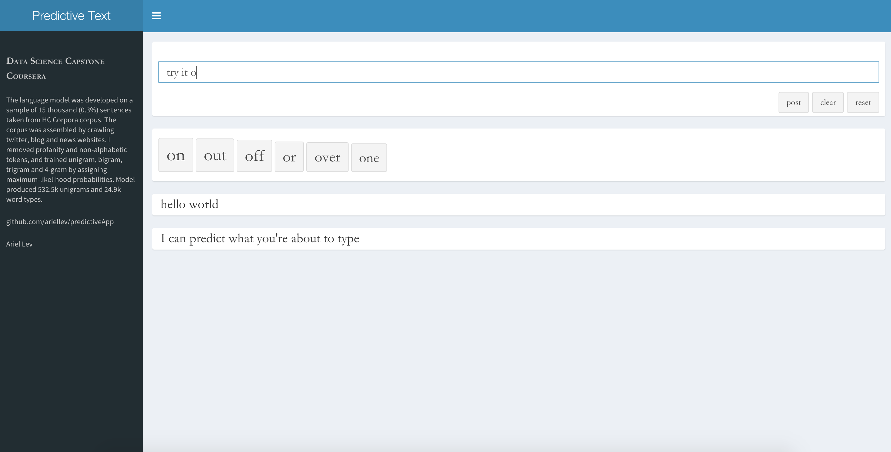

Overview
---
 
* PredictApp is a predictive text application.
* The language model was developed on a sample of 15 thousand (0.3%) sentences taken from HC Corpora corpus. The corpus was assembled by crawling twitter, blog and news websites. More info [HC Corpora](http://www.corpora.heliohost.org)
* I removed profanity and non-alphabetic tokens. 
* I trained unigram, bigram, trigram and 4-gram by assigning maximum-likelihood probabilities.
* Model produced 532.5k unigrams and 24.9k word types.
* https://ariellev.shinyapps.io/predictApp
* https://github.com/ariellev/predictApp

---

Usage
---
 
* Very intuitive to use. PredictApp is much like any other familiar predicitve text software found in nowadays mobile devices.
* User types-in, app comes up with suggestions along the way. 
* User can anytime append a suggestion to the input line by clicking over it.
* Suggestions are sorted from most (left) to least (right) likeable.
* User can post, clear or reset the application.

---

## Screenshot

<!-- Limit image width and height -->

<!-- Center image on slide -->

